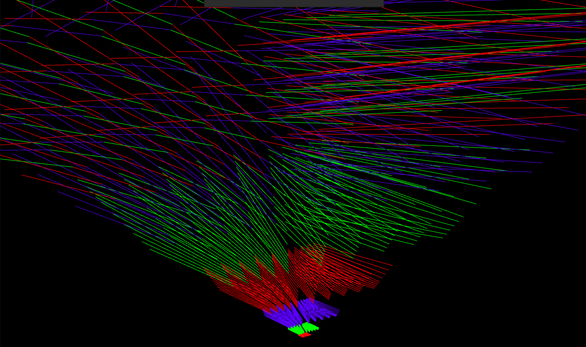

WebGL Forward+ and Clustered Deferred Shading
======================

**University of Pennsylvania, CIS 565: GPU Programming and Architecture, Project 5**

* Paul (San) Jewell
  * [LinkedIn](https://www.linkedin.com/in/paul-jewell-2aba7379), [work website](
    https://www.biociphers.org/paul-jewell-lab-member), [personal website](https://gitlab.com/inklabapp), [twitter](https://twitter.com/inklabapp), etc.
* Tested on: (TODO) Linux pop-os 5.11.0-7614-generic, i7-9750H CPU @ 2.60GHz 32GB, GeForce GTX 1650 Mobile / Max-Q 4GB

[comment]: <> (### Live Online)

[comment]: <> ([![]&#40;img/thumb.png&#41;]&#40;http://TODO.github.io/Project5-WebGL-Forward-Plus-and-Clustered-Deferred&#41;)

### Demo Video/GIF

|       |  |
| ----------- | ----------- |
|       |        |
|    |         |

### (TODO: Your README)

This project involved many components. Including implementing Clustered lighting, Deferred shading,
optimizations and visual enhancements in a new language and framework. 

The method I used for the longest part of the project, the clustered lighting, was based off of this article:
http://www.aortiz.me/2018/12/21/CG.html#part-2? ; Unfortunately, because seemingly the method described had not been
used my any of my mentors, I was unable to receive much feedback, and thus, while I can demonstrate the core
crux of the algorithm, it is not in a completed state at the time of submission. 

### Clustering approach

While the above document was extremely helpful in general, it was marginally difficult to adapt to my use case. In the 
base code that we are provided, We are instructed to compute the lights-per-cluster algorithm on the CPU (javascript), 
whereas in the article author's approach, all code was done in parallel on the GPU, and some rendering aspects relevant
to adapting it to this project were left unmentioned. (specifically, how to apply the lights to the scene after calculation)
Because I'd heard that compute shaders has very limited support in webGL, I went ahead with trying to adapt the program
to follow the project template structure. 

The other main difference is that this article used exponential Z-slicing instead of linear. This ia actually a great idea
in general and I was excited to try it. Here is a screenshot from my debugging to give you an idea of how the exponential
frustums look:

(The camera would be directly behind the smallest red group, representing the near plane)

The beauty of this approach is that the general "baseline" of this shape can be calculated only once with the same FOV 
camera, and then checked each frame against lights, a much simpler calculation, by applying the camera/world transformation.
(this can be seen in the assembleClusters and updateClusters in base.js). The method I used for detecting which lights were 
in each cluster involved using three.js Box3 and Sphere classes, making one for each AABB in the mini-frustum, and using 
three.js collision detection algorithm to check for overlap. 

### Toon shader

After the bulk of time spent on the more technical aspects of clustered shading, this fun visual effect was a nice distraction.

In this example I implemented it over the original forward shader to avoid any interactions with other performances changes
I may or may not have been making with my deferred and cluster attempts. The shader only introduces minimal operations at the 
very end of the shading pipeline and practically has no noticeable effects on performance.

The toon shader uses a few basic rules with respect to lighting and camera position to effectively reduce the number of colors
in the palette over one surface of an object, which makes the rendering have a slightly more 'traditional art' feel, 
less photorealistic. 

I did not attempt it, but the feature could be likely improved past my quick write up by pre-computing the result of
the components used in the branching statements and storing them in a compressed g-buffer for the deferred pass. 

### Performance improvement attempt

I attempted to use two G buffers instead of three to store the needed information, by encoding the normal values
into the last two unused positions (.w) of the color and position g-buffers. While theoretically using fewer G-buffers
should have an impact, I was not able to spot a discernible difference in performance using this approach. 

### Performance Analysis

Even with the troublesome rendering bugs, I'm still able to get an accurate judgement of the differences in performance 
in the core of the implementations. In the work I completed, which produces the same overall results, for both Clustered-Deferred
and Forward+. In the case of my implementation, almost all of the core algorithm is the same. Both primarily use clusters
to reduce the number of lights applied to each object rendered for each screen pixel. The deferred method additionally separated
the pass for calculating positions and normals into a texture buffer instead of calculating them in the main fragment. 

..Possibly because of additional memory bandwidth, but more likely because none of the optimizations I did were on the 
deferred component, I notice a significant performance difference between Forward+ and Clustered Deferred. My Forward
plus implementation is highly optimized as described earlier, and gets from 55-60FPS on my machine, while the clustered
implementation only reaches an average of 32FPS. Clearly it's may not be as useful for the tested environment, all other
things considered. 

### Unfortunate conclusions

Before, I'd mentioned that the clustered algorithm was incomplete. Despote many iterations I was unable to isolate the 
issue in time. I was able to isolate that my x and y slices were behaving properly, as in the left shot when the number
or Z slices is set to zero, however, when using the depth slicing with exponential components, I encountered frequent bugs.
I plan to resolve this issue once the resources become available. 

|       |  |
| ----------- | ----------- |
|       |        |

### Credits

* [Three.js](https://github.com/mrdoob/three.js) by [@mrdoob](https://github.com/mrdoob) and contributors
* [stats.js](https://github.com/mrdoob/stats.js) by [@mrdoob](https://github.com/mrdoob) and contributors
* [webgl-debug](https://github.com/KhronosGroup/WebGLDeveloperTools) by Khronos Group Inc.
* [glMatrix](https://github.com/toji/gl-matrix) by [@toji](https://github.com/toji) and contributors
* [minimal-gltf-loader](https://github.com/shrekshao/minimal-gltf-loader) by [@shrekshao](https://github.com/shrekshao)
* [A Primer On Efficient Rendering Algorithms & Clustered Shading.] (http://www.aortiz.me/2018/12/21/CG.html#part-2?)
* [Wikibooks: Toon shading] (https://en.wikibooks.org/wiki/GLSL_Programming/Unity/Toon_Shading)

